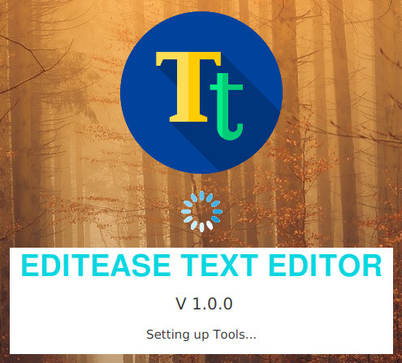
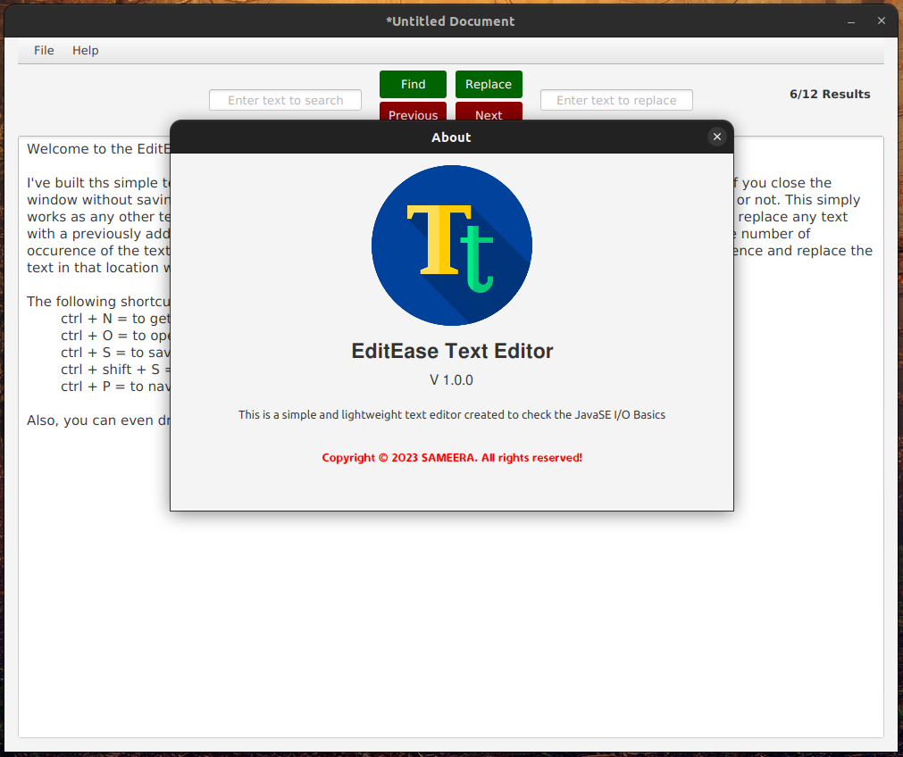
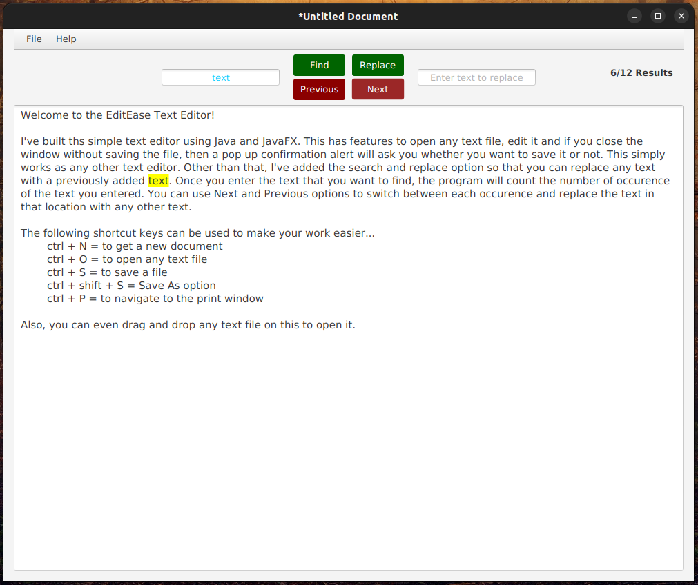
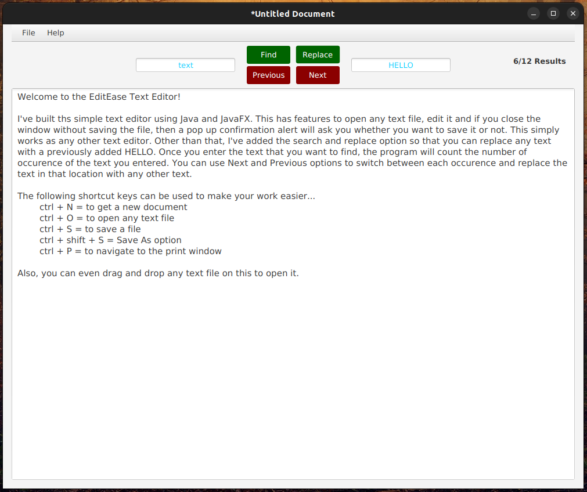

<!-- ABOUT THE PROJECT -->
# <b>EditEase Text Editor</b>

### Version 1.0.0

<b>Welcome to the EditEase Text Editor!</b>  

I've built ths simple text editor using Java and JavaFX. This has features to open any text file, edit it and if you close the window without saving the file, then a pop up confirmation alert will ask you whether you want to save it or not. This simply works as any other text editor. Other than that, I've added the <b>search and replace</b> option so that you can replace any text with a previously added text. Once you enter the text that you want to find, the program will count the number of occurrence of the text you entered. You can use Next and Previous options to switch between each occurence and replace the text in that location with any other text. 

The following shortcut keys can be used to make your work easier...  
ctrl + N = to get a new document  
ctrl + O = to open any text file  
ctrl + S = to save a file  
ctrl + shift + S = Save As option  
ctrl + P = to navigate to the print window  

Also, you can even drag and drop any text file on this to open it.

## Built with using

* Java
* JavaFX

### License
Copyright 2023 SAMEERA. All Rights Reserved.